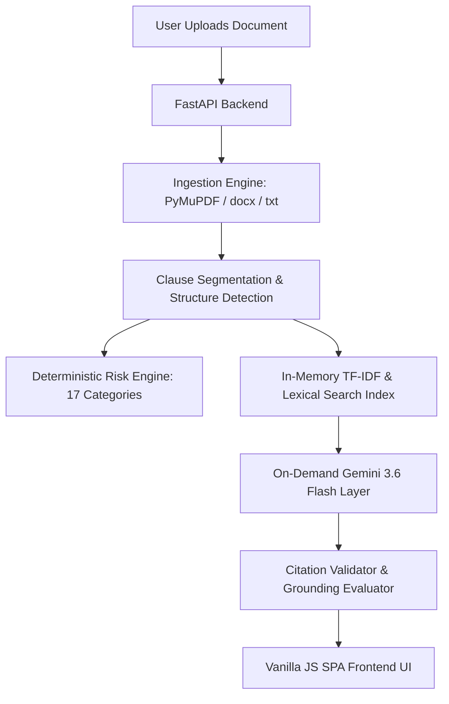

# LexiGuard — Legal Document Intelligence Assistant

> Understand your documents. See the risks. Ask better questions.


---

## 1. Executive Summary & Problem Statement

Ordinary individuals and businesses facing contracts, leases, NDAs, or terms of service often lack the legal expertise to identify hidden risks or asymmetric obligations. They are left with two options: pay expensive legal fees for routine review, or proceed blindly.

**LexiGuard** bridges this gap. It is an **evidence-grounded AI legal document intelligence assistant** designed to help non-lawyers and legal professionals analyze complex documents, identify attention areas, ask grounded questions, compare document versions, inspect clause relationships, and generate review checklists.

---

## 2. Core Capabilities

- **Document Understanding & Overview**: Deterministic clause segmentation, page mapping, entity/date extraction, and executive summaries.
- **Risk & Attention Signals**: Configurable 17-category risk detection engine highlighting asymmetric terms, hidden fees, automatic renewals, and liability caps.
- **Clause Relationships**: Automatic detection of reciprocal, dependent, and asymmetric clause pairs across documents.
- **Financial & Compensation Intelligence**: Extraction and analysis of payment schedules, salary, bonus structures, invoices, and late fee penalties.
- **Evidence-Grounded Q&A**: Question answering constrained strictly to document text, backed by citation validation and visual grounding status indicators.
- **Document Comparison (Version Diffing)**: Version comparison showing added, removed, and modified provisions with AI change explanations.
- **Interactive Review Checklist**: Preparation guide generated from document-specific risks and obligations.
- **Export & Calendar Reminders**: PDF report export and RFC-5545 calendar (.ics) reminders for key contract deadlines.
- **Workspace Library**: Multi-document management and metadata overview.

---

## 3. Architecture & AI Strategy

### "Evidence First, LLM Second" Philosophy

LexiGuard enforces a **deterministic-first architecture**:
1. **Zero LLM calls** are used for document ingestion, parsing, keyword indexing, or structural risk flagging.
2. **TF-IDF + Lexical + Structural Search**: Instant in-memory retrieval without neural embedding latency or vector database overhead.
3. **Gemini On-Demand**: Google Gemini (`gemini-3.6-flash`) is invoked exclusively for generative tasks (Q&A, summaries, complex diff explanations).
4. **Citation Validation & Abstention**: Output is programmatically validated against source clauses. If evidence is insufficient, the system explicitly abstains.



---

## 4. Security & Safety Controls

- **Prompt Injection Defense**: Untrusted document text is enclosed inside `<document_evidence>` XML tags and declared as data only.
- **Citation Verification**: Every citation `[Section X, Page Y]` is validated against real clauses in the SQLite index. Unverified citations are flagged with `(UNVERIFIED REFERENCE)`.
- **Legal Disclaimer**: LexiGuard provides document preparation assistance and evidence explanations. It does not provide legal advice or act as a licensed attorney.
- **Production Key Isolation**: API keys and secrets are loaded exclusively via environment variables (`GEMINI_API_KEY`). No secrets are committed.

---

## 5. Deployment Guide (Google Cloud Run)

LexiGuard is optimized for lightweight, containerized deployment on **Google Cloud Run**.

### Local Run

```bash
# Clone repository
git clone https://github.com/your-repo/lexiguard.git
cd lexiguard

# Create virtual environment
python -m venv venv
source venv/bin/activate  # On Windows: venv\Scripts\activate

# Install dependencies
pip install -r requirements.txt

# Set up environment file
cp .env.example .env
# Add your GEMINI_API_KEY to .env

# Run FastAPI server
uvicorn app.main:app --host 0.0.0.0 --port 8000
```

### Google Cloud Run Deployment

```bash
# Build Container Image
gcloud builds submit --tag gcr.io/YOUR_PROJECT_ID/lexiguard:latest

# Deploy to Cloud Run
gcloud run deploy lexiguard \
  --image gcr.io/YOUR_PROJECT_ID/lexiguard:latest \
  --platform managed \
  --region us-central1 \
  --allow-unauthenticated \
  --set-env-vars GEMINI_API_KEY="your_gemini_api_key_here",GEMINI_MODEL="gemini-3.6-flash"
```

---

## 6. Test Suite & Quality Verification

LexiGuard maintains a comprehensive automated test suite covering API endpoints, ingestion, risk engines, citation validation, report generation, and security boundaries.

```bash
# Run full test suite
pytest -q
```

**Results**: `329 passed, 0 failed, 0 skipped` across 17 test modules.

---

## 7. Configuration Reference

| Variable | Description | Default |
|---|---|---|
| `GEMINI_API_KEY` | Google Gemini API Key | `""` |
| `GEMINI_MODEL` | Gemini Model Identifier | `gemini-3.6-flash` |
| `PORT` | Container Port (set automatically by Cloud Run) | `8000` |
| `CORS_ORIGINS` | Comma-separated allowed HTTP origins | `http://localhost:8000,http://127.0.0.1:8000` |
| `MAX_UPLOAD_SIZE_MB` | Maximum file upload size in MB | `10` |
| `DB_PATH` | SQLite prototype database path | `./lexiguard.db` |
