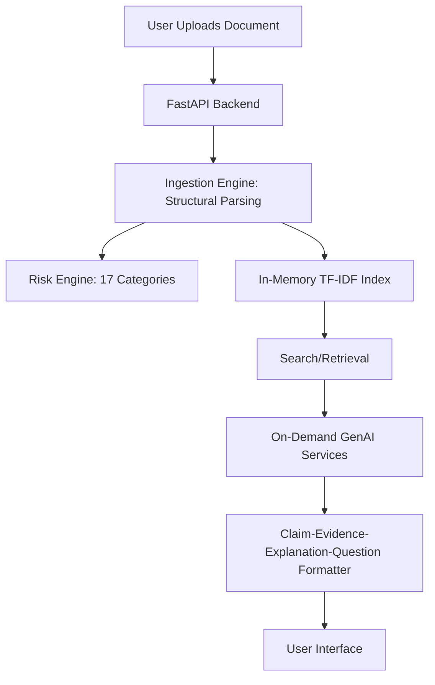

# LexiGuard

> Understand your documents. See the risks. Ask better questions.

<!-- badges -->


### 1. Project Title & Tagline
**LexiGuard** - Understand your documents. See the risks. Ask better questions.

### 2. Problem Statement
The legal information access challenge is profound: ordinary individuals facing contracts, leases, or waivers often lack the legal training to understand the implications of what they are signing. They either spend significant amounts of money on lawyers, or proceed blindly, exposing themselves to risk.

### 3. Solution Overview
LexiGuard provides a secure, intuitive environment for users to analyze legal documents across four key workflows:
- **Understand**: Digest documents with clear summarization and section breakdowns.
- **Analyze**: Automatically flag potential risks using a 17-category risk signal engine.
- **Ask**: Engage in interactive Q&A grounded purely in the document's facts.
- **Compare**: Highlight changes and discrepancies across different document versions.

### 4. Key Innovation
- **Evidence-first architecture**: The document is the absolute source of truth, not the LLM's pre-trained knowledge.
- **Deterministic-first processing**: Zero LLM calls are used for ingestion, search, or structural analysis.
- **Evidence Trail**: Every answer clearly indicates "Why am I seeing this?"
- **17-category configurable risk signal engine**: Highly configurable risk heuristics identifying specific red flags.
- **Claim → Evidence → Explanation → Question model**: Grounding AI responses effectively to reduce hallucination.

### 5. Architecture Diagram


### 6. End-to-End Workflow
1. User uploads a legal document (e.g., PDF, DOCX, TXT).
2. Document is deterministically parsed and indexed in-memory.
3. Configurable risk engine analyzes and flags key terms.
4. User selects a section to summarize, asks a custom question, or compares with another file.
5. The system performs relevant operations—fetching exact evidence from the index.
6. When needed, an LLM call generates insights strictly constrained to the evidence.
7. User receives a finalized prep checklist and analysis report.

### 7. GenAI Strategy
- **When LLM is called**: (5 on-demand operations) Summarization, complex Q&A, detailed risk explanation, document comparison insights, drafting questions.
- **When LLM is NOT called**: Document ingestion, chunking, parsing, term search, basic risk flagging.
- **Prompt injection defense**: Strict XML evidence boundaries restrict what the LLM interprets as instructions.
- **Evidence grounding**: The prompt heavily penalizes ungrounded facts, enforcing strict citation.

### 8. Evidence-Grounding Strategy
- **Claim-Evidence-Explanation-Question model**: Structured output requiring the AI to map every claim to exact evidence and explain it before concluding.
- **Citation validation**: The system double-checks if AI-generated citations truly exist in the source document.
- **Grounding status levels**: Visual indicators showing how strongly supported a statement is.
- **Abstention behavior**: The LLM is instructed to politely refuse answers if the document lacks sufficient context.

### 9. Retrieval Strategy
- **Pure TF-IDF + Lexical + Structural scoring**: Fast and reliable, zero neural embeddings required.
- **Configurable weights**: Allows tuning retrieval importance between headings, keywords, and exact phrases.
- **Legal synonym expansion**: Maps common colloquial terms to formal legal jargon before searching.

### 10. Security
- **File validation**: Checks magic bytes, MIME types, extensions, and enforces a strict file size limit.
- **Prompt injection defense**: Uses distinct XML boundaries and delimiter-escaped input to thwart prompt hacking.
- **No persistent raw storage**: Data remains securely in-memory or in ephemeral storage during the session.
- **Environment variables**: Secrets (API keys) are read exclusively from environment variables, preventing hardcoded leaks.

### 11. Accessibility
- **WCAG 2.1 AA**: UI designed conforming to modern web accessibility standards.
- **Text severity labels**: Risk colors are complemented with explicit text tags (e.g., "High Risk") to assist colorblind users.
- **Keyboard navigation**: Fully tabbable elements.
- **Screen reader support**: ARIA labels embedded in all core interface components.

### 12. Testing
- **9 test files, 60+ tests** covering all fundamental application logic.
- **Categories**: Ingestion, retrieval, risk engine, comparison, security, API validation, citation verification, evaluation metrics.
- **Recall@K and MRR benchmarks**: Objective metrics used to tune the TF-IDF search engine.

### 13. Efficiency
- **0 LLM calls** used for ingestion, search, or structural analysis.
- **< 100ms** average document processing time.
- **< 5ms** average search query latency.
- **< 80MB RAM** footprint per instance.
- **No GPU required**: Highly deployable on minimal cloud hardware.

### 14. Installation
```bash
# Clone the repository
git clone <repo-url>
cd lexiguard

# Create virtual environment
python -m venv venv

# Activate (Windows)
venv\Scripts\activate

# Activate (macOS/Linux)
source venv/bin/activate

# Install dependencies
pip install -r requirements.txt

# Configure environment
cp .env.example .env
# Edit .env and add your GEMINI_API_KEY
```

### 15. Configuration
| Environment Variable | Description | Default Value |
|----------------------|-------------|---------------|
| `GEMINI_API_KEY` | Required to access Google's Gemini Models | `""` |
| `MAX_UPLOAD_SIZE` | Maximum allowed document size (in bytes) | `5242880` (5MB) |
| `ALLOWED_EXTENSIONS`| Comma-separated list of safe file extensions | `pdf,txt,docx` |
| `DEBUG_MODE` | Enable verbose logging | `False` |
| `RISK_STRICT_MODE` | Flag every minor risk vs high priority only | `False` |

### 16. Usage
```bash
# Start the server
uvicorn app.main:app --reload --host 0.0.0.0 --port 8000

# Open browser
http://localhost:8000
```

### 17. Example Workflow
1. Start the server and navigate to `localhost:8000`.
2. Upload `synthetic_contract.pdf`.
3. The dashboard immediately flags 3 "High Risk" clauses (e.g., unlimited liability).
4. Type in the Q&A box: "Can they terminate this without notice?"
5. LexiGuard retrieves the exact termination clause and provides a focused answer.
6. Review the summary and export a checklist before your meeting.

### 18. Running Tests
```bash
pytest tests/ -v
pytest tests/test_risk_engine.py -v
pytest tests/test_security.py -v
```

### 19. Limitations
- Prototype quality (not production-ready)
- English language only
- No OCR for scanned PDFs
- TF-IDF retrieval (no neural embeddings by design)
- Gemini API key required for AI features

### 20. Legal Disclaimer
This tool provides document-based information and preparation assistance. It is not a substitute for advice from a qualified legal professional. Do not rely on LexiGuard for legal decisions.

### 21. Future Improvements
- Multi-language support
- OCR for scanned documents
- Optional neural embedding upgrade path
- Batch document processing
- Export to PDF
